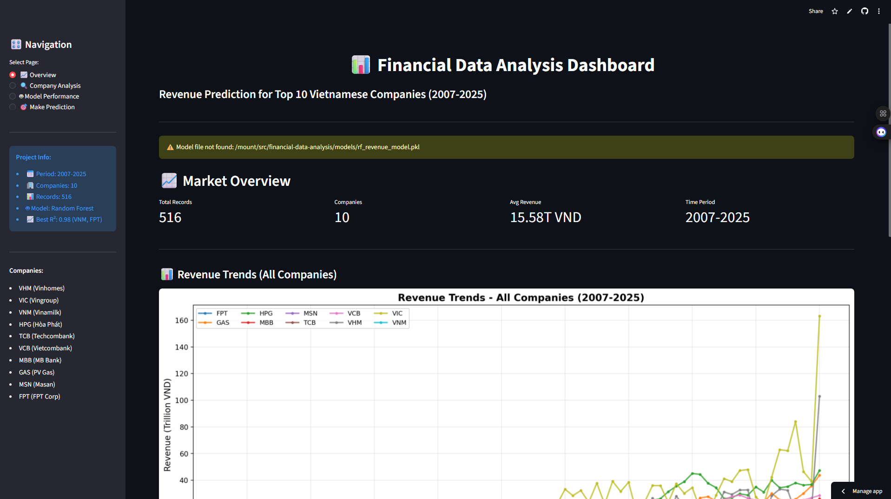
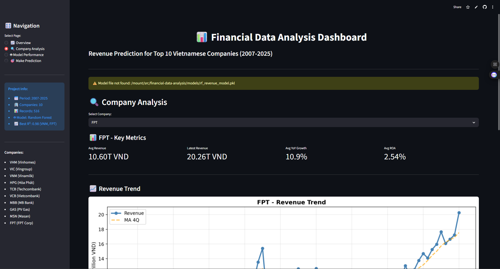
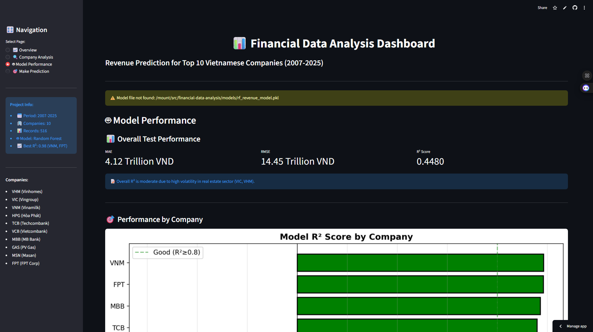
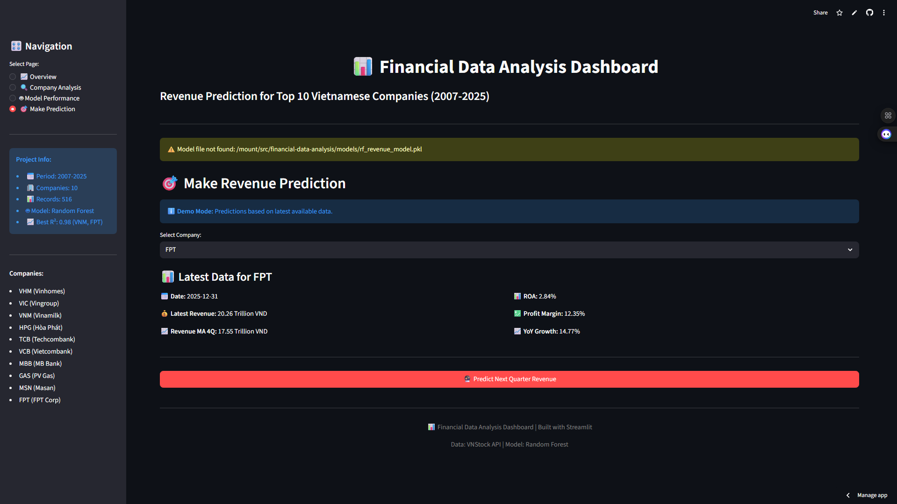

# 📊 Financial Data Analysis & Revenue Prediction

[](https://www.python.org/)
[](YOUR_STREAMLIT_URL)
[](LICENSE)

Dự án phân tích dữ liệu tài chính và dự đoán doanh thu của 10 công ty hàng đầu Việt Nam (2007-2025)

## 🚀 Live Demo

**👉 [TRY THE INTERACTIVE DASHBOARD HERE](https://fr0dy-financial-data-analysis.streamlit.app/)** 👈

### 🎯 Quick Access
- 📊 **Live Dashboard:** [CLICK HERE](https://fr0dy-financial-data-analysis.streamlit.app/)
- 📂 **GitHub Repo:** [https://github.com/Fr0dy/financial-data-analysis](https://github.com/Fr0dy/financial-data-analysis)
- 📖 **Documentation:** See below

---

## 📸 Screenshots

### Overview Page


### Company Analysis


### Model Performance


### Revenue Prediction


## 🎯 Mục tiêu

- Thu thập và xử lý dữ liệu tài chính từ VNStock API
- Phân tích xu hướng doanh thu, tăng trưởng, và các chỉ số tài chính
- Xây dựng model Machine Learning để dự đoán doanh thu quý tiếp theo
- Tạo dashboard và báo cáo trực quan

## 📂 Cấu trúc Project

| Thư mục/File | Mô tả |
|--------------|-------|
| **📁 data/** | Dữ liệu project |
| ├── 📁 raw/ | Dữ liệu thô từ VNStock API |
| └── 📁 processed/ | Dữ liệu đã xử lý và feature engineering |
| **📁 notebooks/** | Scripts phân tích và xử lý dữ liệu |
| ├── 🐍 05_collect_financial_statements.py | Thu thập dữ liệu tài chính |
| ├── 🐍 06_data_cleaning.py | Làm sạch và chuẩn hóa dữ liệu |
| ├── 🐍 07_exploratory_data_analysis.py | Phân tích khám phá dữ liệu |
| ├── 🐍 08_feature_engineering.py | Tạo features cho model |
| └── 🐍 09_model_training.py | Training và evaluation model |
| **📁 models/** | Trained machine learning models |
| ├── 🤖 rf_revenue_model.pkl | Random Forest model đã train |
| └── 📄 model_features.txt | Danh sách features |
| **📁 reports/** | Báo cáo và visualizations |
| └── 📁 figures/ | Charts và graphs |
| **📁 streamlit_app/** | Interactive web dashboard |
| └── 🎨 app.py | Streamlit application |
| **📄 requirements.txt** | Python dependencies |
| **📄 README.md** | Project documentation |

## 🏆 Kết quả

- **516 records** từ 10 công ty (2007-2025)
- **19 features** được tạo từ feature engineering
- **Random Forest Model** với R² = 0.45 (overall test)
- **Best predictions**: VNM (R²=0.98), FPT (R²=0.98)
- **19 visualizations** và 1 báo cáo chi tiết

## 🔧 Technologies

- Python 3.x
- pandas, numpy
- scikit-learn
- matplotlib, seaborn
- vnstock3

## 📊 Key Insights

- **VIC, HPG, GAS** dẫn đầu về doanh thu (20-28 Trillion VND)
- **VHM, VIC** có tăng trưởng cao nhất nhưng biến động mạnh
- **VNM, FPT** ổn định và dễ dự đoán nhất
- Model hoạt động tốt cho các công ty ổn định, khó khăn với BĐS

## 📧 Contact

[Pham Ngoc Khanh] - [khanhpn.forwork@gmail.com]

Project Link: [https://github.com/Fr0dy/financial-data-analysis]

## 🙏 Acknowledgments
VNStock - Vietnamese Stock Market API
Streamlit - Web framework
Scikit-learn - Machine Learning library

<div align="center"> <p>Made with ❤️ by Fr0d</p> <p>⭐ Star this repo if you find it useful!</p> </div> ```
